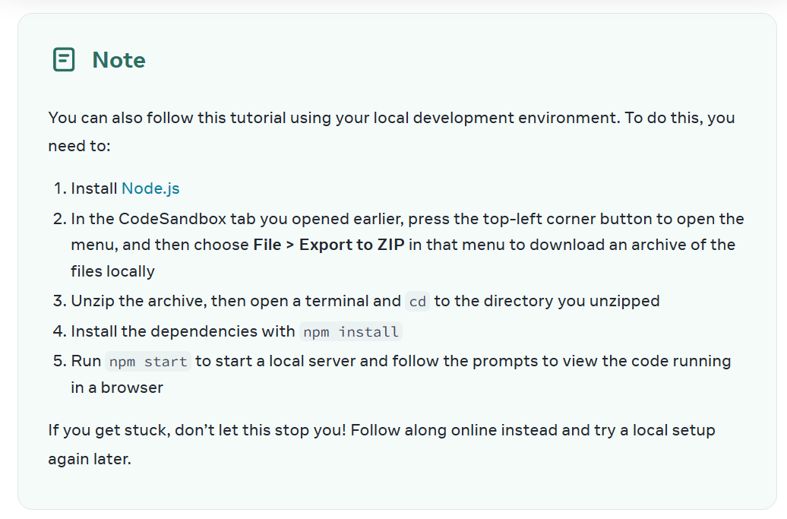
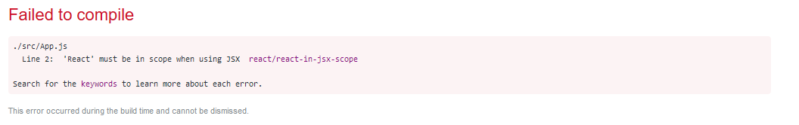
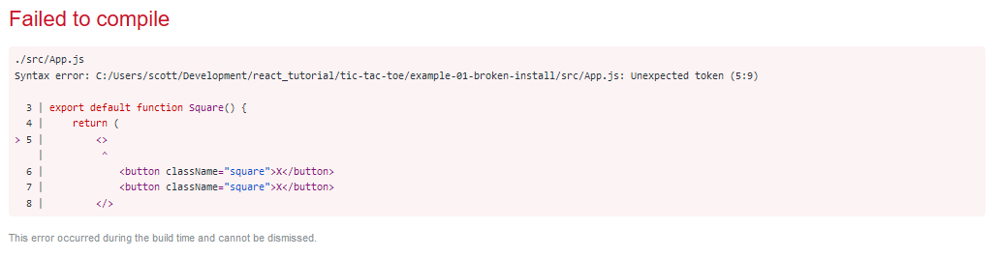
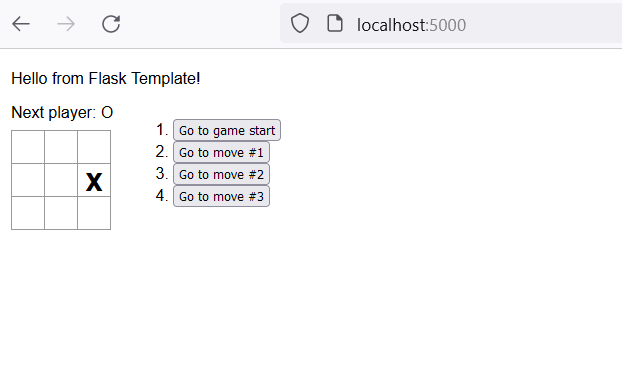

# Background

When building a large codebase from scratch, usually there's periods of growth interspersed with periods of consolidation.
In my case, I was building a moderately-sized Flask project whose front-end consisted of many interwoven html templates and vanilla JS scripts.
Due to the increasing size and complexity, I decided to invest in learning a framework, and React seemed like a good choice given its popularity and reputation.
This repo consists of my attempts to learn React and to integrate it into an existing Flask project.

# Learning React

In my experience, when confronting any new technology, a good "first step" is to walk through some of the tutorials in order to internalize the basics of that technology.
As with learning any new skill, the first step was to google "learn react reddit" and click the first result. This quickly  led me to the official docs at [react.dev/learn](https://react.dev/learn).

## Initial Friction

The official docs have a [tic-tac-toe tutorial](https://react.dev/learn/tutorial-tic-tac-toe), which was my first real foray into actually using React.
I became *extremely* frustrated with this tutorial at the time.
This tutorial relies heavily on a magic "run everything in the browser" tool at [codesandbox.io](https://codesandbox.io/), but to me this felt "cutesy" for someone trying to learn a serious tool and integrate it into a real live-running project.
There were instructions for how to run the tutorial locally:



But following these instructions led to an error:



After some [googling](https://stackoverflow.com/questions/42640636/react-must-be-in-scope-when-using-jsx-react-react-in-jsx-scope) I changed `App.js` from this:

```
export default function Square() {
  return <button className="square">X</button>;
}
```

To this:

```
import React from "react";

export default function Square() {
  return <button className="square">X</button>;
}
```

Which compiled! But then the next step was to return two buttons:

```
export default function Square() {
    return (
        <>
            <button className="square">X</button>
            <button className="square">X</button>
        </>
    );
}
```

Which again failed:



At this point all the google results were saying "you're using JS and need to be using JSX duhhh!!!" even though this is the *default* installation from *their* repository.
I finally said "fuck it" and used the stupid cutesy in-browser tool for the rest of the tutorial.
At some point even this broke and I had to re-fork the code from a later step to get it working again.
Hopefully the devs at React will fix the local install issues.
In hindsight the tutorial was quite good from a conceptual standpoint, but the install issues were very frustrating at the time.

## React

To put it in my own words, the main high-level motivation behind React is the ability to develop a front-end by nesting custom html-like entities called *components*.
Components are programmable, re-usable, and can even be passed variables from components higher up in the DOM tree.
Components return an object that maps to an embeddable HTML fragment.
Probably their most useful feature is the ability to seamlessly react to changes in state, hence the name *React*.
Components can even be given callback functions that update state in their parent components, called *hooks*.
Going by the tic-tac-toe example, a typical React project  might have immutable state variables defined higher in the Component tree, with hooks that update these state variables lower in the Component tree.
Note that "immutable" in this context refers to an existing value not changing state, however the state can always be updated to a new immutable value.

## Flask Integration

One of the problems I ran into when searching for "Flask+React" was that most tutorials (eg [ref1](https://blog.miguelgrinberg.com/post/how-to-create-a-react--flask-project), [ref2](https://dev.to/nagatodev/how-to-connect-flask-to-reactjs-1k8i)) assumed that the *entire* front-end would be served with a React-focused full-stack framework (such as node.js), while the Flask back-end would exist solely as a separate API returning JSON files from a database.
While this final design would probably be better overall, my general approach to refactoring is to proceed as gradually as possible.
Given I already have a codebase full of Flask templates and Javascript files, my preference would be to start carving out React components from the inside-out, starting with the most obvious use-cases first, until *eventually maybe* there's no more templates and it's one big React Component at the top, and then perhaps I would switch to npm for the front-end.

I found this really great [Medium Tutorial](https://ephemera.medium.com/using-react-with-flask-without-create-react-app-eb81edb641b8 ) that integrated React with Flask in three different ways, without relying on a separate node server.
As I worked through the tutorial, I tried to serve up the tic-tac-toe example in its final form, embedded as a Component inside a Flask template.

### Example 1 - CDN

The "easiest" (and worst) way to integrate React is with a "Content Delivery Network" or CDN.
In the CDN approach, all the libraries for running React are fetched externally from the user's browser as the page is loading.
There are a couple problems with this.
First it could be slow, since the user has to make multiple requests to multiple different sites before the page starts working.
Second, there are potential vulnerabilities (both security and reliability) by loading external scripts.
For all we know, five or ten years from now the link might no longer even work.

That being said, it is the easiest to get up and running, since it requires no additional installations on the back-end side.
Although "easiest" is perhaps a misnomer, as I still had to slog through quite a few errors before I was able to get tic-tac-toe to work.
The folder 'react-flask-example/example-01-cdn' has a working final version, and can be run with these commands and navigating to `localhost:5000`:

```
cd react-flask-example
cd example-01-cdn
virtualenv venv
./venv/scripts/activate
pip install -r requirements.txt
flask run
```

It works!



Here's the code for the template:

```
<!DOCTYPE html>
<html>
    <head>
        <title>Hello World Example</title>
        <link rel= "stylesheet" type= "text/css" href= "{{ url_for('static',filename='styles.css') }}">
        <script crossorigin src="https://unpkg.com/react@18/umd/react.development.js"></script>
        <script crossorigin src="https://unpkg.com/react-dom@18/umd/react-dom.development.js"></script>
        <script crossorigin src="https://cdnjs.cloudflare.com/ajax/libs/babel-standalone/7.22.9/babel.js"></script>
        <script>var exports={};</script>
        <script type="text/babel" src="{{url_for('static', filename='App.js')}}"></script>
        <script type="text/babel" src="{{url_for('static', filename='index.js')}}"></script>
    </head>
    <body>
        <p>Hello from Flask Template!</p>
        <div id="root">
        </div>
    </body>
</html>
```

The code for `App.js` needed to change this:
```
import { useState } from 'react';
```
To this:
```
const { useState } = React;
```

While the code for `index.js` was changed from this:
```
import React, { StrictMode } from "react";
import { createRoot } from "react-dom/client";
import "./styles.css";

import App from "./App";

const root = createRoot(document.getElementById("root"));
root.render(
  <StrictMode>
    <App />
  </StrictMode>
);
```
To this:
```
const { StrictMode } = React;
const { createRoot } = ReactDOM;

const root = createRoot(document.getElementById("root"));
root.render(
  <StrictMode>
    <Game />
  </StrictMode>
);
```

Main things to note are:
1. The scripts for React and Babel are loaded in the first three `script` tags that have have the `crossorigin` property. Babel is a JS library that can take JSX scripts with the `"text/babel"` tag as input and transform them into a working JS script as output.
2. The line `var exports={};` is a bit peculiar.
    Without it the code doesn't work, and the browser console produces this error: `Uncaught ReferenceError: exports is not defined`.
    Searching this error brought me to [this SO post](https://stackoverflow.com/questions/43042889/typescript-referenceerror-exports-is-not-defined), with the needed fix as the first response.
    A comment in that SO post links to [this other SO post](https://stackoverflow.com/questions/19059580/browser-uncaught-referenceerror-require-is-not-defined) with a similar error `require is not defined`.
    Apparently it's because commands like `export` and `require` don't exist in default browser JS but do exist in a related language called CommonJS, which is used in many React compilation environments.
3. Using `import { x } from 'y';` causes the error `x is not defined`, and the fix to use `const { x } = Y;` was found from [this SO post](https://stackoverflow.com/questions/38219311/reactjs-uncaught-referenceerror-require-is-not-defined).
4. Not sure how I discovered changing `<App />` to `<Game />`, it might have been from reading the [Mozilla Docs](https://developer.mozilla.org/en-US/docs/web/javascript/reference/statements/export) and figured the original name might be in the global scope instead of the filename.
I'm still not 100% sure how the whole "export name = filename" works in a compiled environment such as npm.

In any case I probably spent more time on this step than I needed, but I learned a few things about Babel and Javascript imports/exports in the process so maybe it was worth it.
